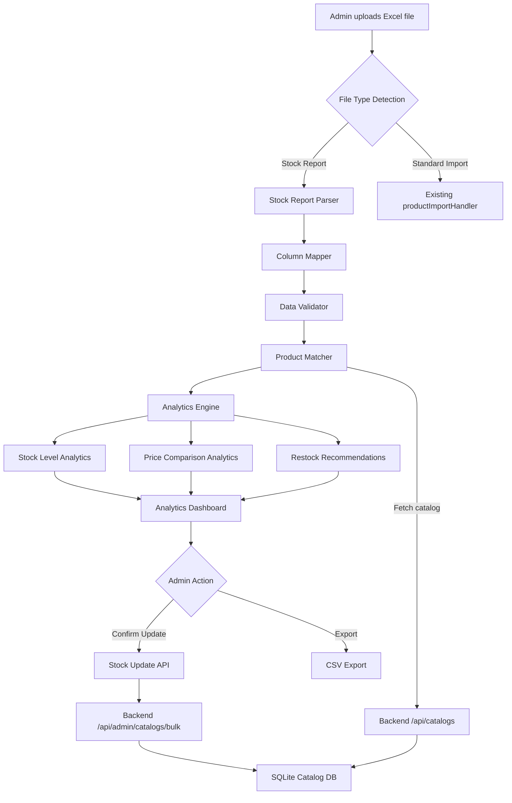

# Design Document: Excel Stock Import Analytics

## Overview

This feature extends the existing bulk import system at `/dashboard/admin/catalog/bulk-import` to detect, parse, and analyze stock report files from physical store locations. The system adds a parallel processing path alongside the existing product import flow: when a stock report file is detected (based on column headers), it routes through a specialized Stock Report Parser, Column Mapper, and Analytics Engine before presenting insights on a dedicated Analytics Dashboard panel.

The architecture follows the existing pattern of frontend-driven Excel parsing (using the `xlsx` library) with backend API calls for catalog matching and stock updates. Analytics computation happens client-side to avoid additional backend complexity and to provide instant feedback.

### Key Design Decisions

1. **Client-side parsing and analytics**: Stock report parsing and analytics computation happen in the browser, consistent with the existing `productImportHandler.ts` pattern. This avoids new backend endpoints for parsing and keeps the system responsive.
2. **Backend for catalog matching and updates**: Product matching against the SQLite catalog and stock status updates use the existing `/api/admin/catalogs/bulk` endpoint pattern.
3. **Additive architecture**: The stock report flow is a new branch in the existing import component, not a replacement. Standard product imports continue to work unchanged.
4. **localStorage for history**: Import history with analytics snapshots is stored in `bulkImportHistory` localStorage (existing pattern), extended with analytics metadata.

## Architecture



### Data Flow

1. **Upload**: Admin uploads an Excel file via the existing drag-and-drop or file picker UI
2. **Detection**: The system reads column headers from the first row and classifies the file
3. **Parsing**: Stock Report Parser normalizes columns, parses numeric values, validates rows
4. **Matching**: Parsed products are matched against the catalog via API call
5. **Analytics**: Analytics Engine computes stock levels, price comparisons, and recommendations
6. **Display**: Analytics Dashboard renders metrics, charts, and actionable lists
7. **Action**: Admin can confirm stock updates (routed to existing bulk endpoint) or export CSV

## Components and Interfaces

### Frontend Components

#### `StockReportDetector` (utility module)
```typescript
interface DetectionResult {
  isStockReport: boolean;
  confidence: number; // number of matched stock columns
  matchedColumns: string[];
  error?: string;
}

function detectFileType(headers: string[]): DetectionResult;
```

#### `StockColumnMapper` (utility module)
```typescript
interface ColumnMapping {
  productName?: string;    // source column header
  physicalStock?: string;  // "stok fisik" / "qty" / "jumlah"
  systemStock?: string;    // "stok sistem"
  sellingPrice?: string;   // "harga jual" / "harga" / "price"
  location?: string;       // "lokasi" / "location" / "gudang"
  productCode?: string;    // "kode barang" / "kode" / "sku"
  unmapped: string[];      // columns that didn't match any known mapping
}

interface MappedRow {
  productName: string;
  physicalStock: number | null;
  systemStock: number | null;
  sellingPrice: number | null;
  location: string | null;
  productCode: string | null;
  extras: Record<string, any>;
  warnings: string[];
}

function mapColumns(headers: string[]): ColumnMapping;
function normalizeHeader(header: string): string;
function parseNumericValue(value: string): { value: number; warning?: string };
function mapRow(row: Record<string, any>, mapping: ColumnMapping): MappedRow;
```

#### `StockReportParser` (utility module)
```typescript
interface ParsedStockRow {
  rowNumber: number;
  productName: string;
  physicalStock: number;
  systemStock: number | null;
  sellingPrice: number | null;
  location: string | null;
  productCode: string | null;
  isValid: boolean;
  errors: string[];
  warnings: string[];
}

interface StockParseResult {
  rows: ParsedStockRow[];
  invalidRows: ParsedStockRow[];
  skippedRows: number;
  duplicatesRemoved: number;
  storeLocation: string | null;
  reportDate: string | null;
}

function parseStockReport(workbook: XLSX.WorkBook, fileName: string): StockParseResult;
function extractLocationFromFileName(fileName: string): { location: string | null; date: string | null };
function validateRow(row: MappedRow, rowNumber: number): ParsedStockRow;
function deduplicateRows(rows: ParsedStockRow[]): { unique: ParsedStockRow[]; duplicateCount: number };
```

#### `AnalyticsEngine` (utility module)
```typescript
interface StockHealthCategory {
  habis: number;    // zero stock
  kritis: number;   // 1-5 units
  normal: number;   // 6-50 units
  berlebih: number; // >50 units
}

interface StockAnalytics {
  totalProducts: number;
  totalStockQuantity: number;
  averageStock: number;
  zeroStockCount: number;
  belowThresholdCount: number; // below 5 units
  healthDistribution: StockHealthCategory;
  restockList: RestockItem[];
  discrepancies: DiscrepancyItem[];
}

interface RestockItem {
  productName: string;
  physicalStock: number;
  category: 'habis' | 'kritis';
  rowNumber: number;
}

interface PriceAnalytics {
  totalCompared: number;
  priceIncreases: number;
  priceDecreases: number;
  averageChangePercent: number;
  discrepancies: PriceDiscrepancy[];
}

interface PriceDiscrepancy {
  productName: string;
  catalogPrice: number;
  reportPrice: number;
  difference: number;
  percentChange: number;
  rowNumber: number;
}

interface DiscrepancyItem {
  productName: string;
  physicalStock: number;
  systemStock: number;
  difference: number;
  rowNumber: number;
}

function computeStockAnalytics(rows: ParsedStockRow[]): StockAnalytics;
function computePriceAnalytics(rows: ParsedStockRow[], catalogProducts: Product[]): PriceAnalytics;
function generateRestockRecommendations(rows: ParsedStockRow[]): RestockItem[];
```

#### `StockAnalyticsDashboard` (React component)
```typescript
interface StockAnalyticsDashboardProps {
  stockAnalytics: StockAnalytics;
  priceAnalytics: PriceAnalytics | null;
  storeLocation: string | null;
  reportDate: string | null;
  parsedRows: ParsedStockRow[];
  onProductClick: (rowNumber: number) => void;
  onExport: () => void;
}
```

#### `StockUpdateConfirmDialog` (React component)
```typescript
interface UpdateBreakdown {
  toHidden: number;   // stock = 0
  toIndent: number;   // stock 1-5
  toAvailable: number; // stock > 5
  total: number;
}

interface StockUpdateConfirmDialogProps {
  breakdown: UpdateBreakdown;
  onConfirm: () => void;
  onCancel: () => void;
}
```

### Backend Components

The backend uses the existing `/api/admin/catalogs/bulk` endpoint for stock updates. A new lightweight endpoint is added for catalog product matching:

#### New Endpoint: `GET /api/admin/catalogs/match`
```rust
/// Query parameters: names (comma-separated product names)
/// Returns matched products with their current stock status and price
#[derive(Deserialize)]
struct MatchQuery {
    names: String, // comma-separated, URL-encoded
}

#[derive(Serialize)]
struct MatchResult {
    matched: Vec<MatchedProduct>,
    unmatched: Vec<String>,
}

#[derive(Serialize)]
struct MatchedProduct {
    id: String,
    name: String,
    price: f64,
    stock: String, // "available" | "hidden" | "indent"
    category: String,
}
```

## Data Models

### Stock Report Row (Frontend)
```typescript
interface StockReportRow {
  rowNumber: number;
  productName: string;
  physicalStock: number;
  systemStock: number | null;
  sellingPrice: number | null;
  location: string | null;
  productCode: string | null;
}
```

### Analytics Snapshot (stored in localStorage)
```typescript
interface AnalyticsSnapshot {
  healthDistribution: StockHealthCategory;
  priceDiscrepanciesCount: number;
  restockRecommendationsCount: number;
  totalProducts: number;
  totalStockQuantity: number;
  storeLocation: string | null;
  reportDate: string | null;
}
```

### Extended Import History Entry
```typescript
interface BulkImportHistory {
  id: string;
  timestamp: number;
  fileName: string;
  type: 'Stock Report' | 'Standard Import';
  successCount: number;
  errorCount: number;
  results: string[];
  details?: Array<{ rowNumber?: number; name?: string; status: string; reason?: string }>;
  totalItems: number;
  analyticsSnapshot?: AnalyticsSnapshot; // only for stock reports
}
```

### Product Match Result (Backend Response)
```rust
// SQLite query result
struct CatalogProduct {
    id: String,
    name: String,
    price: f64,
    stock: String,
    category: String,
}
```

### Stock Update Payload (reuses existing BulkOperation)
The stock update reuses the existing `BulkOperation::Update` variant, setting:
- `stock`: "hidden" | "indent" | "available" based on physical stock quantity
- `price`: updated only if the stock report contains a price column

## Correctness Properties

*A property is a characteristic or behavior that should hold true across all valid executions of a system—essentially, a formal statement about what the system should do. Properties serve as the bridge between human-readable specifications and machine-verifiable correctness guarantees.*

### Property 1: Stock Report Detection Threshold

*For any* set of column headers, the file SHALL be classified as a stock report if and only if it contains at least 2 columns from the set {"stok fisik", "stok sistem", "selisih", "lokasi", "kode barang", "qty", "jumlah"} (matched case-insensitively after normalization). If fewer than 2 stock columns are present and no standard import columns exist, an error SHALL be returned.

**Validates: Requirements 1.1, 1.2, 1.4**

### Property 2: Header Normalization Idempotence and Correctness

*For any* string input, the `normalizeHeader` function SHALL produce output that is: (a) entirely lowercase, (b) has no leading or trailing whitespace, and (c) contains no consecutive internal whitespace characters. Additionally, applying `normalizeHeader` twice SHALL produce the same result as applying it once (idempotence).

**Validates: Requirements 2.2**

### Property 3: Column Mapping Completeness

*For any* set of column headers, every header SHALL either map to exactly one known internal field OR appear in the unmapped list with its original name preserved. No header SHALL be silently dropped.

**Validates: Requirements 2.1, 2.3**

### Property 4: Numeric Parsing Round-Trip

*For any* valid numeric value, formatting it with Indonesian currency conventions (Rp prefix, dot as thousand separator, comma as decimal separator) and then parsing it with `parseNumericValue` SHALL produce the original numeric value (within floating-point tolerance).

**Validates: Requirements 2.4**

### Property 5: Row Validation Correctness

*For any* row of stock report data, the row SHALL be marked valid if and only if: (a) the product name after trimming is between 1 and 200 characters AND (b) at least one stock column contains a parseable numeric value. Rows with empty/whitespace-only names SHALL be marked invalid with "Nama produk tidak boleh kosong", and rows with a valid name but no parseable stock values SHALL be marked invalid with "Tidak ada nilai stok yang valid".

**Validates: Requirements 3.1, 3.2, 3.3**

### Property 6: Deduplication Preserves Last Occurrence

*For any* list of parsed stock rows containing duplicate product names (case-insensitive), the deduplication function SHALL retain exactly one entry per unique name, and that entry SHALL be the last occurrence (highest row number) from the original list.

**Validates: Requirements 3.5**

### Property 7: Product Name Matching

*For any* product name from a stock report and any catalog of products, the matching function SHALL find a match if and only if there exists a catalog product whose name, after trimming and lowercasing, equals the report product name after trimming and lowercasing. Unmatched products SHALL be marked as "Produk tidak ditemukan di katalog".

**Validates: Requirements 4.1, 4.3**

### Property 8: Match Count Invariant

*For any* stock report with N valid rows matched against a catalog, the sum of matched count and unmatched count SHALL equal N (total rows processed).

**Validates: Requirements 4.4**

### Property 9: Stock Health Categorization

*For any* non-negative integer stock quantity, the categorization function SHALL assign exactly one health category: "Habis" if quantity = 0, "Kritis" if 1 ≤ quantity ≤ 5, "Normal" if 6 ≤ quantity ≤ 50, "Berlebih" if quantity > 50. The sum of products across all categories SHALL equal the total number of products.

**Validates: Requirements 5.1, 5.2**

### Property 10: Restock List Sorted and Bounded

*For any* list of parsed stock rows, the restock recommendation list SHALL: (a) contain at most 10 items, (b) be sorted by physical stock quantity in ascending order, and (c) only include products with zero or critical stock levels (0-5 units).

**Validates: Requirements 5.3**

### Property 11: Stock Discrepancy Computation

*For any* parsed stock row with both physical stock and system stock values, the discrepancy SHALL equal (physical stock − system stock), and the row SHALL be flagged with "Selisih Stok" if and only if the absolute value of the discrepancy exceeds 3.

**Validates: Requirements 5.4**

### Property 12: Price Analytics Computation and Flagging

*For any* matched product with a non-zero catalog price and a report price, the price difference SHALL equal (report price − catalog price), the percentage change SHALL equal ((report price − catalog price) / catalog price) × 100, and the product SHALL be flagged as "Perlu Review Harga" if and only if the absolute percentage change exceeds 5%.

**Validates: Requirements 6.1, 6.2**

### Property 13: Price Discrepancies Sorted Descending

*For any* list of price discrepancies, the output SHALL be sorted by absolute price difference in descending order.

**Validates: Requirements 6.5**

### Property 14: Stock Quantity to Status Mapping

*For any* non-negative integer physical stock quantity, the stock status mapping SHALL produce: "hidden" if quantity = 0, "indent" if 1 ≤ quantity ≤ 5, "available" if quantity > 5.

**Validates: Requirements 8.1**

### Property 15: Import History Buffer Bounded

*For any* sequence of import history entries, the stored history SHALL never exceed 50 records, and when the limit is exceeded, the oldest entries (lowest timestamp) SHALL be removed first.

**Validates: Requirements 9.4**

### Property 16: File Name Location and Date Extraction

*For any* file name following the pattern "laporan stok {location} {day} {indonesian_month} {year}..." (case-insensitive), the extraction function SHALL correctly identify the location text (between "laporan stok" and the date portion) and the date components. The location SHALL have leading/trailing whitespace and underscores trimmed.

**Validates: Requirements 10.1**

## Error Handling

### Frontend Error Handling

| Error Scenario | Handling Strategy |
|---|---|
| Invalid file format (not .xls/.xlsx) | Display error toast "Format file tidak valid. Gunakan file Excel (.xls atau .xlsx)", abort processing |
| Unrecognized column format | Display error listing expected formats for both stock report and standard import |
| Numeric parsing failure | Set value to 0, add warning to cell, continue processing |
| Empty/invalid rows | Mark as invalid with specific error message, exclude from analytics |
| Negative stock values | Include in results with warning "Stok negatif terdeteksi" |
| Catalog API unavailable | Display error "Katalog tidak dapat dijangkau", preserve parsed data for retry |
| Partial bulk update failure | Continue processing remaining products, show success/failure summary |
| localStorage quota exceeded | Show warning notification, do not block import completion |
| Zero products parsed | Display empty state message instead of empty analytics sections |

### Backend Error Handling

| Error Scenario | Handling Strategy |
|---|---|
| Database connection failure | Return 500 with "Internal Server Error", log details |
| Product not found during update | Skip product, add to errors list, continue batch |
| Transaction failure | Rollback, return error with count of affected operations |
| Invalid product data in bulk payload | Skip invalid entry, add to errors list with row number |

### Error Recovery

- Parsed stock report data is preserved in component state even when matching or update fails
- Admin can retry matching after catalog becomes available
- Failed individual product updates don't block the rest of the batch
- Import history is saved regardless of partial failures

## Testing Strategy

### Property-Based Testing (Frontend)

The analytics computation logic is well-suited for property-based testing. Use `fast-check` library for TypeScript property tests.

**Configuration:**
- Minimum 100 iterations per property test
- Each test references its design document property
- Tag format: **Feature: excel-stock-import-analytics, Property {number}: {property_text}**

**Target modules for PBT:**
- `StockReportDetector` — detection threshold logic (Property 1)
- `StockColumnMapper` — normalization, mapping, numeric parsing (Properties 2, 3, 4)
- `StockReportParser` — validation, deduplication (Properties 5, 6)
- `AnalyticsEngine` — all analytics computations (Properties 9-14)
- `stockStatusMapper` — quantity to status mapping (Property 14)
- `historyManager` — buffer management (Property 15)
- `fileNameParser` — location/date extraction (Property 16)

**PBT library:** `fast-check` (TypeScript, well-maintained, integrates with Vitest)

### Property-Based Testing (Backend - Rust)

The backend already has `proptest` as a dev dependency. Property tests for:
- Product name matching logic (Property 7)
- Match count invariant (Property 8)

**PBT library:** `proptest` (already in Cargo.toml dev-dependencies)

### Unit Tests (Example-Based)

- File format validation (invalid file types)
- Toast notification on stock report detection
- Merged cell handling in Excel
- Catalog API failure handling
- Confirmation dialog display
- Partial update failure handling
- History badge display
- Empty state rendering
- Location display in title case
- Date formatting in Indonesian locale

### Integration Tests

- End-to-end flow: upload stock report → parse → match → analytics → update
- Backend bulk endpoint with stock status updates
- localStorage persistence and retrieval
- CSV export file content verification

### Visual/Component Tests

- Analytics Dashboard rendering with various data states
- Stock health distribution chart
- Restock recommendations list
- Price discrepancy table
- Empty state display

