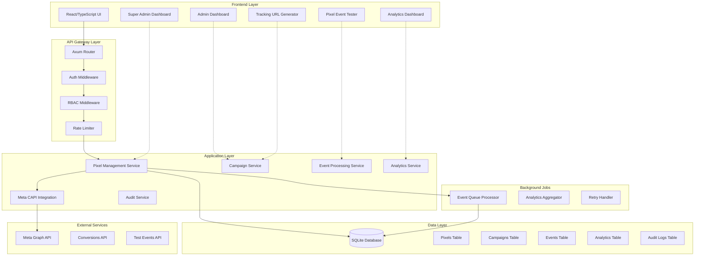
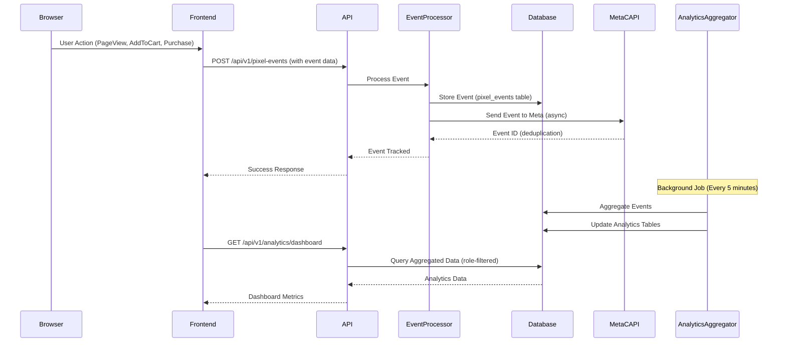

# Design Document: Meta Pixel Tracking System with Multi-Role Access Control

## Overview

The Meta Pixel Tracking System is a comprehensive multi-tenant tracking platform that enables Super Admins to manage master Meta Pixels, assign them to multiple Admins, and provide role-based access to pixel events, campaigns, and analytics. The system implements the "Master Pixel Strategy" where a single Meta Pixel ID is shared across multiple admins with unique attribution parameters, enabling data pooling for Meta's AI while maintaining separate reporting per admin.

The system integrates with Meta's Conversions API (CAPI) for server-side event tracking, provides real-time event monitoring, campaign management with custom conversions, and comprehensive analytics dashboards tailored to each user role (Super Admin, Admin, Agent, Sales, Marketing). Built on Rust/Axum backend with SQLite database, the system ensures high performance (<100ms event processing latency), scalability (1000+ concurrent campaigns), and complete audit trails for compliance.

## Architecture

### System Components



### Data Flow Architecture



## Database Schema

### Entity Relationship Diagram

```mermaid
erDiagram
    USERS ||--o{ PIXELS : creates
    USERS ||--o{ PIXEL_ADMINS : assigned_to
    PIXELS ||--o{ PIXEL_ADMINS : has
    PIXELS ||--o{ CAMPAIGNS : contains
    CAMPAIGNS ||--o{ PIXEL_EVENTS : tracks
    CAMPAIGNS ||--o{ CUSTOM_CONVERSIONS : defines
    PIXEL_EVENTS ||--o{ CONVERSIONS : generates
    USERS ||--o{ PIXEL_EVENTS : triggers
    PIXELS ||--o{ PIXEL_ANALYTICS : aggregates
    CAMPAIGNS ||--o{ CAMPAIGN_ANALYTICS : aggregates
    USERS ||--o{ AUDIT_LOGS : performs
    PIXELS ||--o{ AUDIT_LOGS : affects
    
    USERS {
        TEXT id PK
        TEXT email UK
        TEXT name
        TEXT role
        TEXT password_hash
        BOOLEAN is_active
        BOOLEAN is_verified
        DATETIME created_at
    }
    
    PIXELS {
        TEXT id PK
        TEXT pixel_id UK "Meta Pixel ID"
        TEXT name
        TEXT business_manager_id
        TEXT status "active, inactive, suspended"
        TEXT access_token "Encrypted Meta API token"
        TEXT created_by FK
        TEXT config "JSON: domain verification, event priorities"
        DATETIME created_at
        DATETIME updated_at
    }
    
    PIXEL_ADMINS {
        TEXT id PK
        TEXT pixel_id FK
        TEXT user_id FK
        TEXT permissions "JSON: can_create_campaigns, can_view_analytics"
        DATETIME assigned_at
        TEXT assigned_by FK
    }
    
    CAMPAIGNS {
        TEXT id PK
        TEXT campaign_id UK "Unique campaign identifier"
        TEXT pixel_id FK
        TEXT admin_id FK "User who created campaign"
        TEXT name
        TEXT status "active, paused, completed"
        TEXT utm_source
        TEXT utm_medium
        TEXT utm_campaign
        TEXT utm_admin "Admin identifier for attribution"
        TEXT utm_content
        TEXT utm_term
        TEXT config "JSON: additional settings"
        DATETIME created_at
        DATETIME updated_at
    }
    
    CUSTOM_CONVERSIONS {
        TEXT id PK
        TEXT campaign_id FK
        TEXT name
        TEXT event_type "Purchase, Lead, AddToCart, etc."
        TEXT rules "JSON: URL filters, parameter matches"
        REAL conversion_value
        TEXT currency
        DATETIME created_at
    }
    
    PIXEL_EVENTS {
        TEXT id PK
        TEXT event_id UK "For deduplication with Meta"
        TEXT pixel_id FK
        TEXT campaign_id FK "Nullable"
        TEXT user_id FK "Nullable, if authenticated"
        TEXT event_type "PageView, ViewContent, AddToCart, Purchase, Lead"
        TEXT event_source_url
        TEXT referrer_url
        TEXT user_agent
        TEXT ip_address "Hashed for privacy"
        TEXT fbp "Facebook browser ID cookie"
        TEXT fbc "Facebook click ID cookie"
        TEXT user_data "JSON: hashed email, phone, etc."
        TEXT custom_data "JSON: value, currency, content_ids, etc."
        TEXT utm_params "JSON: all UTM parameters"
        BOOLEAN sent_to_meta
        TEXT meta_event_id "Response from Meta CAPI"
        INTEGER retry_count
        TEXT error_message "If failed"
        DATETIME event_time
        DATETIME created_at
    }
    
    CONVERSIONS {
        TEXT id PK
        TEXT event_id FK
        TEXT campaign_id FK
        TEXT custom_conversion_id FK "Nullable"
        TEXT conversion_type "Purchase, Lead, CompleteRegistration"
        REAL conversion_value
        TEXT currency
        TEXT order_id "For purchase events"
        TEXT custom_data "JSON: product details, etc."
        DATETIME conversion_time
        DATETIME created_at
    }
    
    PIXEL_ANALYTICS {
        TEXT id PK
        TEXT pixel_id FK
        TEXT period_type "hourly, daily, weekly, monthly"
        DATE period_start
        DATE period_end
        INTEGER total_events
        INTEGER unique_users
        INTEGER page_views
        INTEGER add_to_carts
        INTEGER purchases
        INTEGER leads
        REAL total_revenue
        TEXT currency
        TEXT metrics "JSON: detailed breakdown"
        DATETIME created_at
        DATETIME updated_at
    }
    
    CAMPAIGN_ANALYTICS {
        TEXT id PK
        TEXT campaign_id FK
        TEXT period_type "hourly, daily, weekly, monthly"
        DATE period_start
        DATE period_end
        INTEGER total_events
        INTEGER unique_users
        INTEGER conversions
        REAL conversion_rate
        REAL total_revenue
        TEXT currency
        REAL cost_per_conversion "If ad spend data available"
        REAL roas "Return on ad spend"
        TEXT metrics "JSON: detailed breakdown"
        DATETIME created_at
        DATETIME updated_at
    }
    
    AUDIT_LOGS {
        TEXT id PK
        TEXT user_id FK "Nullable for system actions"
        TEXT action_type "pixel.created, campaign.started, admin.assigned"
        TEXT resource_type "pixel, campaign, user"
        TEXT resource_id
        TEXT old_value "JSON: before state"
        TEXT new_value "JSON: after state"
        TEXT ip_address
        TEXT user_agent
        TEXT metadata "JSON: additional context"
        DATETIME created_at
    }
