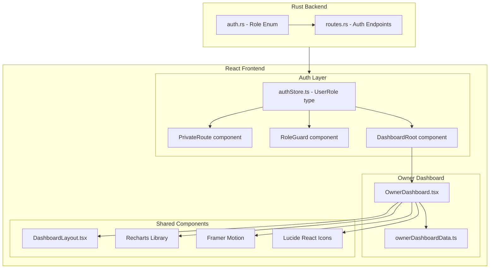
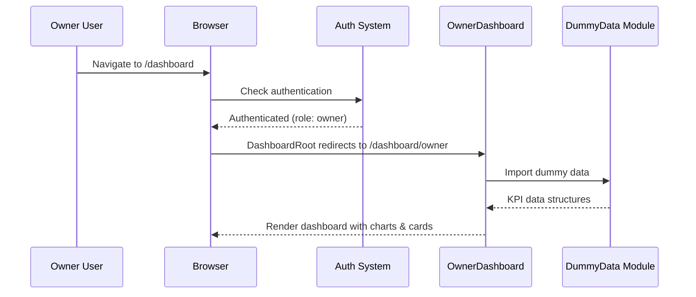
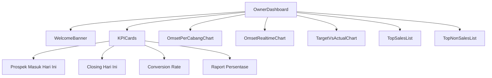

# Design Document: Owner Dashboard

## Overview

Owner Dashboard adalah halaman dashboard eksekutif untuk role "Owner" di sistem Tridjaya Manado. Dashboard ini menyediakan KPI tingkat tinggi yang mencakup prospek masuk, closing, conversion rate, raport persentase, omset per cabang, omset realtime, target vs actual, serta ranking top 10 sales dan non-sales.

Implementasi awal menggunakan dummy data yang disediakan oleh modul terpisah, sehingga UI dapat di-review sebelum integrasi API. Arsitektur dirancang agar penggantian dummy data dengan API call tidak memerlukan perubahan pada komponen UI.

### Key Design Decisions

1. **Dummy data module terpisah** — Semua data dashboard berasal dari satu modul `ownerDashboardData.ts` yang mengekspor struktur data sesuai format API response. Ini memungkinkan swap ke real API tanpa mengubah komponen.
2. **Reuse existing patterns** — Mengikuti pola yang sudah ada di `AdminDashboard.tsx`: Framer Motion animations, glass-card styling, Recharts charts, Lucide icons.
3. **Backend Role extension** — Menambahkan variant `Owner` ke enum `Role` di Rust backend dengan serialisasi "owner".
4. **Frontend-only initial implementation** — Karena menggunakan dummy data, tidak ada endpoint API baru yang diperlukan di fase awal. Backend hanya perlu mengenali role "owner" untuk auth.

## Architecture



### Data Flow



## Components and Interfaces

### Backend Changes

#### Role Enum Extension (`backend/src/auth.rs`)

```rust
#[derive(Clone, Debug, PartialEq, Eq, Serialize, Deserialize)]
#[serde(rename_all = "lowercase")]
pub enum Role {
    Admin,
    Agent,
    Sales,
    Operator,
    Owner,  // NEW
}

impl Display for Role {
    fn fmt(&self, f: &mut Formatter<'_>) -> std::fmt::Result {
        match self {
            Self::Admin => write!(f, "admin"),
            Self::Agent => write!(f, "agent"),
            Self::Sales => write!(f, "sales"),
            Self::Operator => write!(f, "operator"),
            Self::Owner => write!(f, "owner"),
        }
    }
}

impl FromStr for Role {
    type Err = ();
    fn from_str(s: &str) -> Result<Self, Self::Err> {
        match s.to_lowercase().as_str() {
            "admin" => Ok(Self::Admin),
            "agent" => Ok(Self::Agent),
            "sales" => Ok(Self::Sales),
            "operator" => Ok(Self::Operator),
            "owner" => Ok(Self::Owner),
            _ => Err(()),
        }
    }
}
```

### Frontend Changes

#### Auth Store Update (`frontend/src/store/authStore.ts`)

```typescript
export type UserRole = 'admin' | 'operator' | 'sales' | 'agent' | 'owner';
```

#### DashboardRoot Update (`frontend/src/App.tsx`)

```typescript
const DashboardRoot = () => {
  const { user } = useAuthStore();
  const role = user?.role;

  if (role === 'admin') return <Navigate to="/dashboard/admin" replace />;
  if (role === 'owner') return <Navigate to="/dashboard/owner" replace />;
  if (role === 'operator') return <Navigate to="/dashboard/admin/wa/campaigns" replace />;
  if (role === 'sales') return <Navigate to="/dashboard/sales" replace />;
  return <Navigate to="/dashboard/agent" replace />;
};
```

#### Owner Dashboard Route (`frontend/src/App.tsx`)

```tsx
<Route
  path="owner"
  element={
    <RoleGuard roles={["owner"]}>
      {lazyPage(OwnerDashboard)}
    </RoleGuard>
  }
/>
```

#### Owner Dashboard Page Component (`frontend/src/pages/dashboard/OwnerDashboard.tsx`)

Komponen utama yang merender seluruh KPI dashboard. Mengikuti pola `AdminDashboard.tsx`.

#### Dummy Data Module (`frontend/src/data/ownerDashboardData.ts`)

Modul terpisah yang mengekspor semua data dummy dengan tipe yang sesuai format API response.

### Component Hierarchy



## Data Models

### TypeScript Interfaces (`frontend/src/data/ownerDashboardData.ts`)

```typescript
/** Trend direction for KPI cards */
export type TrendDirection = 'up' | 'down' | 'neutral';

/** KPI Card data structure */
export interface KpiCardData {
  label: string;
  value: number;
  formattedValue: string;
  trend: TrendDirection;
  trendPercentage: string; // e.g., "+12.5%" or "-3.2%" or "0%"
  previousValue: number;
}

/** Branch revenue data */
export interface BranchOmset {
  cabang: string;
  omset: number; // in Rupiah
}

/** Hourly revenue data point for realtime chart */
export interface HourlyOmset {
  hour: string; // "00:00", "01:00", etc.
  cumulative: number; // cumulative Rupiah
}

/** Monthly target vs actual data */
export interface TargetVsActual {
  month: string; // e.g., "Jan", "Feb"
  target: number;
  actual: number;
  gapPercentage: number; // ((actual - target) / target) * 100
}

/** Sales personnel ranking entry */
export interface SalesRanking {
  rank: number;
  name: string;
  revenue: number; // in Rupiah
}

/** Non-sales personnel ranking entry */
export interface NonSalesRanking {
  rank: number;
  name: string;
  contributionCount: number;
}

/** Complete owner dashboard data */
export interface OwnerDashboardData {
  prospek: KpiCardData;
  closing: KpiCardData;
  conversionRate: KpiCardData;
  raportPersentase: KpiCardData;
  omsetPerCabang: BranchOmset[];
  omsetRealtime: {
    total: number;
    hourlyData: HourlyOmset[];
  };
  targetVsActual: TargetVsActual[];
  topSales: SalesRanking[];
  topNonSales: NonSalesRanking[];
}
```

### Utility Functions

```typescript
/**
 * Format number as Indonesian Rupiah: "Rp X.XXX.XXX"
 */
export function formatRupiah(value: number): string;

/**
 * Calculate trend between two values.
 * Returns direction and percentage string.
 */
export function calculateTrend(
  today: number,
  yesterday: number
): { direction: TrendDirection; percentage: string };

/**
 * Calculate conversion rate: (closings / prospects) * 100
 * Returns 0 if prospects is 0.
 */
export function calculateConversionRate(closings: number, prospects: number): number;

/**
 * Calculate gap percentage: ((actual - target) / target) * 100
 * Returns 0 if target is 0.
 */
export function calculateGapPercentage(actual: number, target: number): number;

/**
 * Sort and limit a list to top N entries by a numeric key.
 * Ties broken alphabetically by name.
 */
export function topN<T extends { name: string }>(
  items: T[],
  n: number,
  getScore: (item: T) => number
): T[];
```

### Backend Data Model (Future API)

Saat ini tidak ada perubahan schema database. Role "owner" disimpan sebagai string di kolom `role` tabel `users` yang sudah ada. Untuk fase dummy data, tidak ada endpoint API baru.

## Correctness Properties

*A property is a characteristic or behavior that should hold true across all valid executions of a system—essentially, a formal statement about what the system should do. Properties serve as the bridge between human-readable specifications and machine-verifiable correctness guarantees.*

### Property 1: Role Serialization Round-Trip

*For any* Role variant (including Owner), serializing to string and parsing back should produce the original variant. Additionally, *for any* case variation of the string "owner" (e.g., "Owner", "OWNER", "oWnEr"), parsing should produce the Owner variant.

**Validates: Requirements 1.1, 1.2**

### Property 2: RoleGuard Access Control

*For any* user role string, the RoleGuard configured with `roles: ["owner"]` should permit access if and only if the role equals "owner". All other roles (including "admin", "agent", "sales", "operator", and any arbitrary string) should be denied access and redirected.

**Validates: Requirements 1.5, 1.6, 2.2**

### Property 3: Trend Calculation Correctness

*For any* pair of non-negative integers (today, yesterday), the `calculateTrend` function should return:
- direction "up" when today > yesterday
- direction "down" when today < yesterday
- direction "neutral" when today == yesterday
- percentage calculated as `((today - yesterday) / yesterday) * 100` rounded to one decimal place
- percentage "+100%" when yesterday == 0 and today > 0
- percentage "0%" when both are 0

**Validates: Requirements 3.2, 3.3, 3.4, 4.2, 4.3, 5.3, 5.5**

### Property 4: Rupiah Formatting

*For any* non-negative integer value, `formatRupiah(value)` should produce a string matching the pattern `Rp X.XXX.XXX` where dots separate every three digits from the right, with no decimal places. Specifically: `formatRupiah(0)` returns "Rp 0", and for any value > 0, the formatted string should contain only digits and dots after "Rp ".

**Validates: Requirements 4.1, 7.2, 7.5, 8.2, 9.3, 10.2**

### Property 5: Conversion Rate Calculation

*For any* non-negative integers (closings, prospects), `calculateConversionRate(closings, prospects)` should return `(closings / prospects) * 100` when prospects > 0, and `0` when prospects == 0. The result should always be between 0 and a finite positive number (closings can exceed prospects in edge cases like carry-over data).

**Validates: Requirements 5.2, 5.4**

### Property 6: Raport Percentage and Threshold Coloring

*For any* non-negative numbers (actual, target), the raport percentage is `(actual / target) * 100` when target > 0, and `0` when target == 0. The color indicator should be "green" when the percentage >= 100, and "red" when < 100 (including the zero-target case).

**Validates: Requirements 6.2, 6.3, 6.4, 6.5**

### Property 7: Branch Omset Sorting

*For any* list of `BranchOmset` entries, the sorted output should be in strictly non-increasing order by `omset` value. That is, for any adjacent pair (a, b) in the sorted list, `a.omset >= b.omset`.

**Validates: Requirements 7.3**

### Property 8: Omset Aggregation

*For any* list of `BranchOmset` entries, the total omset displayed should equal the sum of all individual `omset` values. When the list is empty or all values are zero, the total should be 0.

**Validates: Requirements 8.1, 8.4, 8.5**

### Property 9: Gap Percentage Calculation and Coloring

*For any* pair of non-negative numbers (actual, target), `calculateGapPercentage(actual, target)` should return `((actual - target) / target) * 100` when target > 0, and `0` when target == 0. The color should be "green" when gap >= 0 and "red" when gap < 0.

**Validates: Requirements 9.4, 9.6, 9.2, 9.7**

### Property 10: Top-N Ranking with Tie-Breaking

*For any* list of items with a name and numeric score, and any N > 0, `topN(items, N, getScore)` should return at most N items sorted in descending order by score. When two items have equal scores, they should be ordered alphabetically by name. The result length should be `min(N, items.length)`.

**Validates: Requirements 10.1, 10.3, 10.4, 11.1, 11.4**

## Error Handling

### Frontend Error Handling

| Scenario | Handling |
|----------|----------|
| Dummy data module fails to load | ErrorBoundary catches, displays fallback UI |
| Division by zero (conversion rate, gap %) | Utility functions return 0, display "0.0%" |
| Empty data arrays | Charts render empty state, KPI cards show 0 |
| Invalid role in auth store | RoleGuard redirects to /dashboard |
| Network error on auth refresh | Existing auth store error handling applies |

### Backend Error Handling

| Scenario | Handling |
|----------|----------|
| Unknown role string in DB | `FromStr` returns `Err(())`, login fails with appropriate error |
| Owner user without proper permissions | Standard 403 response from auth middleware |

### Edge Cases

- **Yesterday's value is 0**: Trend shows "+100%" for any positive today value
- **Both values are 0**: Trend shows neutral with "0%"
- **Target is 0**: Raport and gap percentage show 0% with red indicator
- **Fewer than 10 entries in rankings**: Display only available entries
- **All branches have 0 omset**: Display "Rp 0" total and flat chart line
- **Negative values**: Not expected in business context; utility functions handle non-negative integers only

## Testing Strategy

### Property-Based Testing (PBT)

This feature is suitable for property-based testing because it contains multiple pure utility functions with clear input/output behavior and universal properties that hold across wide input spaces.

**Library**: `fast-check` (already in devDependencies)
**Configuration**: Minimum 100 iterations per property test
**Tag format**: `Feature: owner-dashboard, Property {number}: {property_text}`

Property tests will cover:
- `calculateTrend` — Property 3
- `formatRupiah` — Property 4
- `calculateConversionRate` — Property 5
- Raport percentage + coloring — Property 6
- Branch sorting — Property 7
- Omset aggregation — Property 8
- `calculateGapPercentage` + coloring — Property 9
- `topN` ranking — Property 10

Backend property tests (using `proptest` crate already in dev-dependencies):
- Role serialization round-trip — Property 1

### Unit Tests (Example-Based)

Unit tests will cover:
- RoleGuard access control for owner routes (Property 2 — React component testing)
- DashboardRoot redirect for owner role
- PrivateRoute redirect for unauthenticated users
- Dummy data module completeness (>= 5 branches, >= 10 sales, >= 10 non-sales)
- Dummy data value ranges (prospects 20-200, conversion 10-60%)
- Chart rendering with correct Recharts components
- Responsive layout behavior
- Medal/trophy icons for top 3 entries

### Integration Tests

- Full auth flow: login as owner → redirect to /dashboard/owner
- Route protection: non-owner access denied
- Dashboard renders all KPI sections without errors

### Test File Structure

```
frontend/src/data/__tests__/
  ownerDashboardUtils.property.test.ts   # Property-based tests for utility functions
  ownerDashboardData.test.ts             # Unit tests for dummy data validation

frontend/src/pages/dashboard/__tests__/
  OwnerDashboard.test.tsx                # Component rendering tests

backend/tests/
  auth_role_owner.rs                     # Property tests for Role enum with Owner
```
