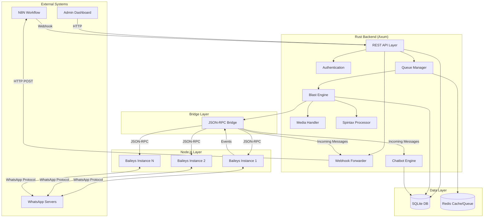
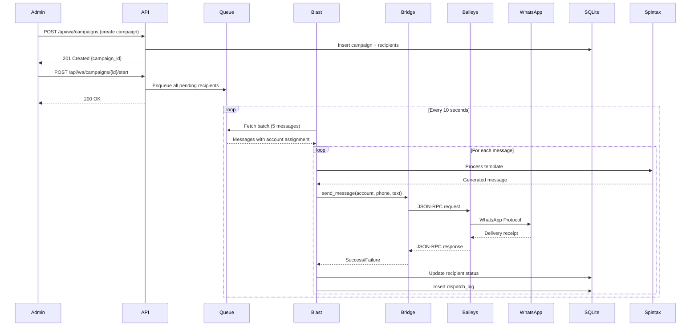
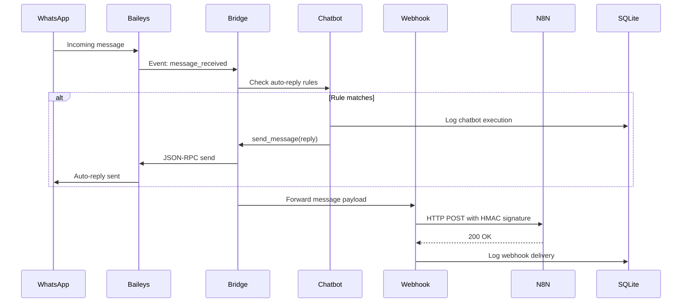

# Design Document: Self-Hosted WhatsApp Gateway

## Overview

The Self-Hosted WhatsApp Gateway is a comprehensive messaging infrastructure that replaces external services (Fonnte, WhatsApp Business API) with an in-house solution built on Rust (Axum backend) and Node.js (Baileys library for WhatsApp protocol). The system provides enterprise-grade blast messaging capabilities with anti-ban features, bidirectional webhook integration with N8N, auto-reply chatbot, and multi-device session management.

### Key Design Goals

1. **High Throughput**: Handle 10,000+ messages per hour across multiple WhatsApp accounts
2. **Anti-Ban Protection**: Simulate human behavior with smart delays, typing indicators, and message variation
3. **Fault Tolerance**: Redis-based queue with retry logic, session persistence, and graceful degradation
4. **Extensibility**: Clean separation between Rust backend and Node.js WhatsApp protocol layer
5. **Observability**: Comprehensive metrics, structured logging, and health checks

### Technology Stack

- **Backend**: Rust 1.75+ with Axum 0.8 web framework
- **Database**: SQLite with SQLx for type-safe queries
- **Cache/Queue**: Redis 7+ for message queuing and caching
- **WhatsApp Protocol**: Baileys (Node.js) via JSON-RPC bridge
- **Async Runtime**: Tokio for concurrent message processing
- **Security**: AES-256-GCM encryption, Argon2id hashing, HMAC-SHA256 signatures

## Architecture

### High-Level System Architecture



### Data Flow Diagrams

#### Outbound Message Flow (Blast Campaign)



#### Inbound Message Flow (Webhook + Chatbot)



## Components and Interfaces

### 1. Session Manager

**Responsibility**: Manage WhatsApp account connections, QR code pairing, session persistence, and connection health monitoring.

**Key Structures**:

```rust
pub struct SessionManager {
    sessions: Arc<RwLock<HashMap<String, SessionState>>>,
    bridge: Arc<BridgeLa