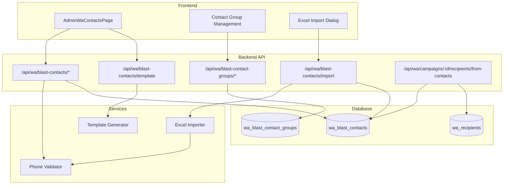

# Design Document: WA Blast Contact Management

## Overview

This feature adds a **centralized contact database** for the WA Blast system, separate from the existing `wa_contacts` table (which is used by the WA Gateway for synced WhatsApp contacts). The blast contact database allows admins to maintain reusable contact lists organized by groups, import contacts via Excel, and select them when creating campaigns — eliminating the need to re-upload recipients for every campaign.

### Key Design Decisions

1. **Separate table from `wa_contacts`**: The existing `wa_contacts` table serves the WA Gateway (synced contacts from WhatsApp). The blast contact database (`wa_blast_contacts`) is a user-managed list specifically for campaign targeting.
2. **Upsert by phone+group**: Uniqueness is enforced per phone number within a group, allowing the same phone to exist in multiple groups.
3. **Reuse existing patterns**: Phone normalization reuses the existing `normalize_phone()` function in `routes.rs`. Excel parsing reuses the `calamine` crate pattern from `upload_wa_recipients_excel`.
4. **Excel generation via `rust_xlsxwriter`**: For template download, we use `rust_xlsxwriter` (lightweight, no external dependencies) to generate `.xlsx` files with multiple sheets.

## Architecture



## Components and Interfaces

### Backend Components

#### 1. Phone Validator (`validate_and_normalize_phone`)

Dedicated function for Indonesian phone number validation and normalization, extending the existing `normalize_phone` logic with stricter rules per requirements.

```rust
pub fn validate_and_normalize_phone(raw: &str) -> Result<String, String> {
    // 1. Strip allowed non-digit chars: +, space, dash
    // 2. Check for disallowed characters
    // 3. Normalize prefix: 08xx -> 628xx, +628xx -> 628xx, 8xx -> 628xx
    // 4. Validate length: 10-15 digits after normalization
    // Returns: Ok("628xxxxxxxxxx") or Err("reason")
}
```

#### 2. Template Generator

Generates a `.xlsx` file with:
- **Sheet 1 "Data"**: Headers (phone, name, var1, var2) + 2 example rows
- **Sheet 2 "Instruksi"**: Format instructions explaining accepted phone formats

#### 3. Excel Importer

Parses uploaded `.xlsx` or `.csv` files:
- Validates header row contains "phone" column
- Iterates data rows, validates phones, deduplicates within file
- Performs upsert (INSERT OR UPDATE) against database
- Returns summary: `{ inserted, updated, skipped, errors: [{row, reason}] }`

#### 4. Campaign Integration Handler

Copies contacts from blast database to `wa_recipients` for a specific campaign:
- Accepts group IDs to select contacts from
- Creates `wa_recipients` rows with status "pending"
- Preserves variables (name, var1, var2) as `variables_json`

### API Endpoints

| Method | Path | Description |
|--------|------|-------------|
| GET | `/api/wa/blast-contacts` | List contacts (paginated, filterable) |
| POST | `/api/wa/blast-contacts` | Create single contact |
| PATCH | `/api/wa/blast-contacts/{id}` | Update contact |
| DELETE | `/api/wa/blast-contacts/{id}` | Delete single contact |
| POST | `/api/wa/blast-contacts/bulk-delete` | Bulk delete contacts |
| GET | `/api/wa/blast-contacts/template` | Download Excel template |
| POST | `/api/wa/blast-contacts/import` | Import from Excel (multipart, 5MB limit) |
| GET | `/api/wa/blast-contact-groups` | List groups with contact count |
| POST | `/api/wa/blast-contact-groups` | Create group |
| PATCH | `/api/wa/blast-contact-groups/{id}` | Update group |
| DELETE | `/api/wa/blast-contact-groups/{id}` | Delete group (nullify contacts) |
| POST | `/api/wa/campaigns/{id}/recipients/from-contacts` | Copy contacts to campaign |

### Frontend Components

#### AdminWaContactsPage
- Main page at `/dashboard/admin/wa/contacts`
- Glass-card design with stats cards (total contacts, total groups)
- Search bar with debounced input (name/phone)
- Group filter dropdown
- Table with columns: Phone, Name, Group, Created At
- Bulk selection with checkbox column
- Action buttons: Download Template, Import Excel, Add Contact, Bulk Delete

#### ContactGroupModal
- Modal for CRUD operations on groups
- Shows group list with contact count badges
- Inline edit/delete for each group

#### ImportExcelDialog
- Drag-and-drop upload area
- File size validation (max 5MB)
- Progress indicator during import
- Summary modal showing results after import

## Data Models

### Database Schema

```sql
-- New migration: 2026051301_wa_blast_contacts.sql

CREATE TABLE IF NOT EXISTS wa_blast_contact_groups (
    id TEXT PRIMARY KEY,
    name TEXT NOT NULL UNIQUE,
    description TEXT,
    created_at DATETIME NOT NULL DEFAULT CURRENT_TIMESTAMP
);

CREATE TABLE IF NOT EXISTS wa_blast_contacts (
    id TEXT PRIMARY KEY,
    phone TEXT NOT NULL,
    name TEXT,
    group_id TEXT,
    variables_json TEXT, -- JSON: {"var1": "...", "var2": "..."}
    created_at DATETIME NOT NULL DEFAULT CURRENT_TIMESTAMP,
    updated_at DATETIME NOT NULL DEFAULT CURRENT_TIMESTAMP,
    FOREIGN KEY (group_id) REFERENCES wa_blast_contact_groups(id) ON DELETE SET NULL,
    UNIQUE(phone, group_id)
);

CREATE INDEX IF NOT EXISTS idx_wa_blast_contacts_phone ON wa_blast_contacts(phone);
CREATE INDEX IF NOT EXISTS idx_wa_blast_contacts_group ON wa_blast_contacts(group_id);
CREATE INDEX IF NOT EXISTS idx_wa_blast_contacts_name ON wa_blast_contacts(name);
CREATE INDEX IF NOT EXISTS idx_wa_blast_contacts_phone_group ON wa_blast_contacts(phone, group_id);
```

### Rust Structs

```rust
#[derive(Debug, Serialize, Deserialize)]
pub struct BlastContact {
    pub id: String,
    pub phone: String,
    pub name: Option<String>,
    pub group_id: Option<String>,
    pub group_name: Option<String>, // joined from groups table
    pub variables_json: Option<String>,
    pub created_at: String,
    pub updated_at: String,
}

#[derive(Debug, Serialize, Deserialize)]
pub struct BlastContactGroup {
    pub id: String,
    pub name: String,
    pub description: Option<String>,
    pub contact_count: i64,
    pub created_at: String,
}

#[derive(Debug, Deserialize)]
pub struct CreateBlastContactRequest {
    pub phone: String,
    pub name: Option<String>,
    pub group_id: Option<String>,
    pub variables: Option<serde_json::Value>, // {"var1": "x", "var2": "y"}
}

#[derive(Debug, Deserialize)]
pub struct ImportResult {
    pub inserted: i64,
    pub updated: i64,
    pub skipped: i64,
    pub errors: Vec<ImportRowError>,
    pub total_rows: i64,
}

#[derive(Debug, Serialize)]
pub struct ImportRowError {
    pub row: usize,
    pub phone: String,
    pub reason: String,
}
```

### TypeScript Interfaces

```typescript
interface BlastContact {
  id: string;
  phone: string;
  name: string | null;
  groupId: string | null;
  groupName: string | null;
  variablesJson: string | null;
  createdAt: string;
  updatedAt: string;
}

interface BlastContactGroup {
  id: string;
  name: string;
  description: string | null;
  contactCount: number;
  createdAt: string;
}

interface ImportResult {
  inserted: number;
  updated: number;
  skipped: number;
  errors: { row: number; phone: string; reason: string }[];
  totalRows: number;
}
```

## Correctness Properties

*A property is a characteristic or behavior that should hold true across all valid executions of a system — essentially, a formal statement about what the system should do. Properties serve as the bridge between human-readable specifications and machine-verifiable correctness guarantees.*

### Property 1: Phone normalization idempotence

*For any* valid Indonesian phone number in any accepted format (08xx, 628xx, +628xx, 8xx), normalizing it SHALL always produce the canonical form `628xxxxxxxxxx`, and normalizing an already-normalized number SHALL return the same value unchanged (idempotence: `normalize(normalize(x)) == normalize(x)`).

**Validates: Requirements 5.1, 5.2**

### Property 2: Invalid phone rejection

*For any* string that after stripping allowed characters (+, space, dash) contains non-digit characters, OR has fewer than 10 digits or more than 15 digits after normalization, the Phone Validator SHALL reject it with an error.

**Validates: Requirements 5.3, 5.4**

### Property 3: Duplicate phone within same group is rejected

*For any* contact with phone P in group G that already exists in the database, attempting to add another contact with the same normalized phone P in the same group G SHALL fail with a descriptive error, and the database state SHALL remain unchanged.

**Validates: Requirements 1.3**

### Property 4: Excel import upsert correctness

*For any* valid Excel file with N unique valid phone numbers where M already exist in the target group, importing SHALL result in exactly (N - M) new insertions and M updates, with updated contacts having their name and variables overwritten by the file data.

**Validates: Requirements 4.5, 4.6**

### Property 5: Excel import in-file deduplication

*For any* Excel file containing duplicate phone numbers (same normalized form), only the first occurrence SHALL be processed and all subsequent duplicates SHALL be counted as skipped.

**Validates: Requirements 4.4**

### Property 6: Import summary arithmetic consistency

*For any* import operation processing T total data rows, the summary SHALL satisfy: `inserted + updated + skipped + errors.length == T`, where each row is counted in exactly one category.

**Validates: Requirements 4.6**

### Property 7: Group deletion nullifies contacts

*For any* group G with N contacts, deleting G SHALL result in all N contacts still existing in the database with their `group_id` set to NULL, and the total contact count SHALL remain unchanged.

**Validates: Requirements 2.3**

### Property 8: Campaign contact copy preserves all data

*For any* set of contacts selected from the blast database for a campaign, the resulting `wa_recipients` rows SHALL have identical phone numbers and `variables_json` containing the same name, var1, and var2 values as the source blast contacts.

**Validates: Requirements 6.2, 6.3**

## Error Handling

| Scenario | Error Type | Response |
|----------|-----------|----------|
| Invalid phone format | `AppError::Validation` | 400 with descriptive message about accepted formats |
| Duplicate phone in same group | `AppError::Validation` | 400 "Nomor telepon sudah ada di grup ini" |
| Duplicate group name | `AppError::Validation` | 400 "Nama grup sudah digunakan" |
| File too large (>5MB) | `AppError::Validation` | 400 "File terlalu besar. Maksimal 5MB" |
| Too many rows (>10,000) | `AppError::Validation` | 400 "File terlalu banyak baris. Maksimal 10.000 baris" |
| Missing "phone" column in Excel | `AppError::Validation` | 400 "Kolom 'phone' tidak ditemukan di header" |
| Contact not found | `AppError::NotFound` | 404 |
| Campaign not found | `AppError::NotFound` | 404 |
| Database error | `AppError::Internal` | 500 (logged) |
| Invalid file format | `AppError::Validation` | 400 "Format file tidak didukung. Gunakan .xlsx atau .csv" |

## Testing Strategy

### Property-Based Tests (using `proptest`)

The project already has `proptest = "1.5"` in dev-dependencies. Property-based tests will validate the core logic with minimum 100 iterations per property.

| Test | Property | Tag |
|------|----------|-----|
| Phone normalization idempotence | Property 1 | `Feature: wa-blast-contact-management, Property 1: Phone normalization idempotence` |
| Invalid phone rejection | Property 2 | `Feature: wa-blast-contact-management, Property 2: Invalid phone rejection` |
| Duplicate phone in same group rejected | Property 3 | `Feature: wa-blast-contact-management, Property 3: Duplicate phone within same group is rejected` |
| Import upsert correctness | Property 4 | `Feature: wa-blast-contact-management, Property 4: Excel import upsert correctness` |
| Import in-file deduplication | Property 5 | `Feature: wa-blast-contact-management, Property 5: Excel import in-file deduplication` |
| Import summary arithmetic | Property 6 | `Feature: wa-blast-contact-management, Property 6: Import summary arithmetic consistency` |
| Group deletion nullifies contacts | Property 7 | `Feature: wa-blast-contact-management, Property 7: Group deletion nullifies contacts` |
| Campaign copy preserves data | Property 8 | `Feature: wa-blast-contact-management, Property 8: Campaign contact copy preserves all data` |

**Generator strategies:**
- Phone numbers: Generate random digit strings of length 8-13, prepend random prefix (08, 62, +62, or none)
- Names: Generate random Unicode strings (including Indonesian characters)
- Variables: Generate random JSON objects with string values
- Group IDs: Generate from a pool of pre-created group UUIDs
- Excel rows: Generate Vec of (phone, name, var1, var2) tuples with controlled duplicate rates

### Unit Tests (example-based)

- Phone normalization with specific known inputs:
  - `"08123456789"` → `"628123456789"`
  - `"+62 812-3456-789"` → `"62812345678"`
  - `"812 3456 7890"` → `"6281234567890"`
- Excel template generation produces valid .xlsx with correct headers and 2 example rows
- Template has instruction sheet as second worksheet
- API request validation (missing required fields, invalid types)
- Single contact CRUD operations
- Group CRUD operations
- Duplicate group name rejection

### Integration Tests

- Full import flow: upload file → parse → validate → insert → verify DB state
- Campaign integration: select group → copy to recipients → verify recipient rows
- Pagination correctness with various page sizes
- Search query matching (partial name, partial phone)
- Group filter returns only contacts in specified group
- Bulk delete removes exactly specified contacts

### Edge Cases (covered by property generators)

- Empty phone strings, whitespace-only strings
- Phone numbers at exact boundary lengths (10 digits, 15 digits)
- Excel files with only header row (no data)
- Unicode characters in name fields
- Very long variable values
- NULL group_id handling (unassigned contacts)
- File exactly at 5MB boundary
- File with exactly 10,000 rows
